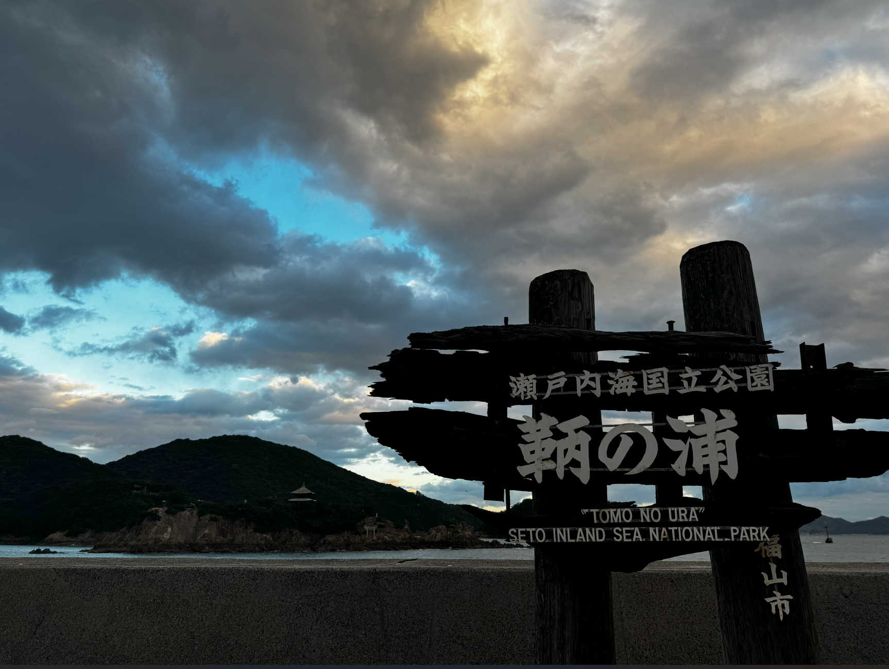
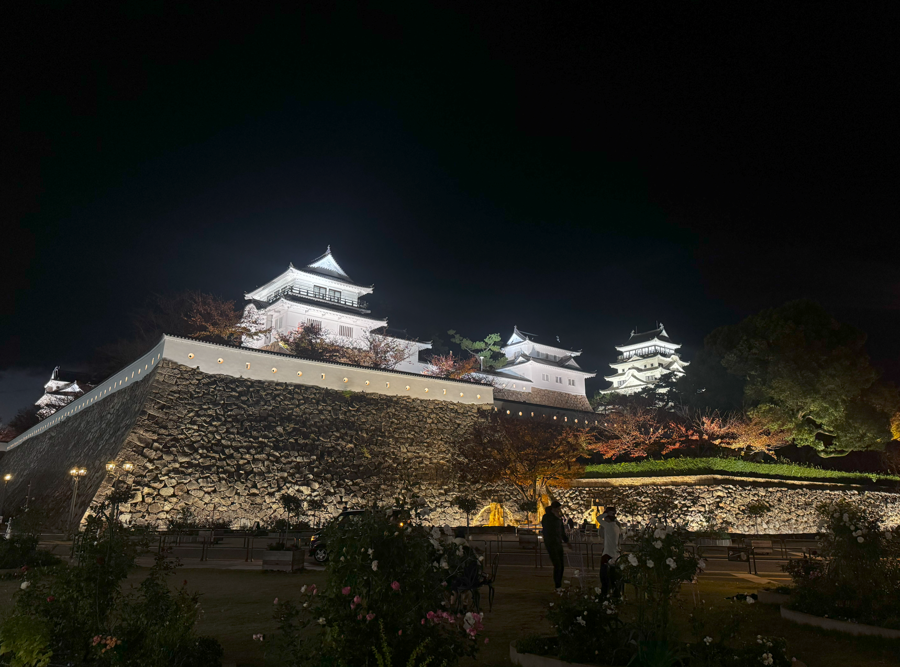
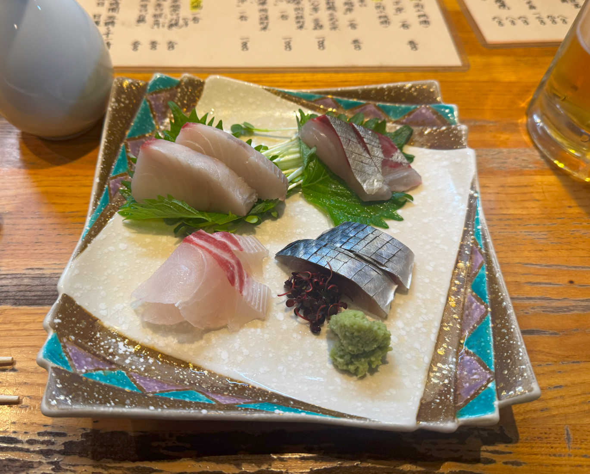

---

title: 11월 28일 - 토모노우라, 오카야마
created: 2025-01-03
tags: ['일본', '여행', '일본 일주', '후쿠야마', '오카야마', '토모노우라']
category: Diary
thumbnail: /src/content/blog/diary/japan-around-trip/assets/image-20250103000803321.png
---

# 11월 28일

## 방문한 곳

- 히로시마현 후쿠야마시
  - 잇코쿠사키가케도우  https://maps.app.goo.gl/8VknsaVpufQNQPqQA
  - 토모노우라
  - 이리에 호메이슈 판매점
  - 이로하마루 전시관
  - 누나쿠마신사
  - 스프와 오니기리 크랭크 https://maps.app.goo.gl/CEwRuniQUCjHDyU4A
  - 후쿠젠지
- 오카야마현 오카야마시
  - 숙소
  - 단단테이 https://maps.app.goo.gl/BmCL9FGeA3fd6yPs6

---

## 일지

### 출발

어제부터 눈이 많이 왔는데, 오늘도 눈이 많이 와 혹시 비행기가 결항 또는 대폭 지연이 될까 걱정되었음.

위 사진과 같이 대부분의 비행기가 지연, 일부 비행기는 취소되는 경우도 있었음. 
다행이 내가 타는 인천 → 기타큐슈 행 비행기는 1시간 정도 지연으로 끝났음. 같은 날 일본 여행가는 친구는 에어서울 비행기였는데 취소되어서 결국 여행도 취소했다고 하는 비운의 결말이..

2시간 정도의 비행 끝에 기타큐슈에 도착하니 바람만 좀 많이 불고 맑은 날씨였음. 
기타큐슈 공항에서 바로 고쿠라 역 가는 버스타고 JR 레일 패스 21일짜리 교환하러 JR트레블 센터로 이동하여 교환하고 첫날 일정을 소화하기 위해 바로 신칸센을 탔음.

첫날 일정은 아래 구글의 타임라인과 같이 기타큐슈 고쿠라역 → 후쿠야마 → 토모노우라 → 오카야마로 잡았음.

우선 신칸센을 타고 고쿠라역에서 후쿠야마역으로 이동했는데 대략 1시간 40분정도 소요됐음. 사쿠라 550호를 탔는데 역시 빠르더라… 비싸긴 하지만.

### 후쿠야마, 토모노우라

후쿠야마역에 도착하니 역 플랫폼에서 바로 아래 사진과 같이 후쿠야마 성이 보여서 좀 신기했음.

우선 코인락커에 짐을 맡기고, 점심을 해결하러 역 안으로 이동함. 맛집을 찾는 것도 좋으나 토모노우라로 가는 버스 편을 생각해서 간단히 역 안에 있는 ‘잇코쿠사키가케도우'라는 라멘집에 방문.

 https://maps.app.goo.gl/8VknsaVpufQNQPqQA

콧테리라멘 + 카라아게 점심 특선으로 1200엔짜리 시킴 맛은 평범한 돈코츠라멘과 평범한 카라아게. 
특별히 맛있지도 없지도 않은… 간단하고 저렴하게 한끼를 해결할 수 있어서 좋았음.

점심을 해결하고 버스를 탄 뒤 토모노우라에 도착한 것은 대략 오후 2시 30분경
해안 풍경이 이쁜 곳임.

토모노우라는 과거 항구마을로 번성했으나 지금은 옛 흔적이 남아있는 조용하고 한적한 곳임. 
사카모토 료마 관련 유적지가 꽤 있고, 미야자키 하야오가 좋아하던 마을이라고 하는데, 힐링하기에 좋은 마을이라고 생각됨. 관광객도 별로 없고…

토모노우라의 명물 중에 하나가 호메이슈(보명주)인데 곳곳에 호메이슈 양조장이 꽤 있음. 
그 중 하나인 이리에 보명주인데 저 가게에서 호메이슈 소프트 아이스크림을 팔길래 하나 먹어봄.
450엔 정도였나 했는데, 홍삼 캔디 맛 첨가 아이스크림 먹는 느낌? 별로 추천은 못하겠음.
여기 말고 다른 이리에 호메이슈 가게에 방문해 호메이슈 시음하고 오미야게 삼아 호메이슈도 하나 삼.
호메이슈 맛은 그냥 홍삼 캔디 맛 나는 술?

토모노우라의 메인이 되는 풍경은 이런 느낌

노을진 풍경도 보고 싶어서 일부러 시간을 더 보냈음.
조용하고 한적한, 그리고 풍경이 좋은 작은 어촌 마을, 힐링하는 기분이 들었음.

메인 거리를 뒤로하고 이리저리 좀 돌아다녔는데 우선 이로하마루 전시관
입장료는 200엔 정도였나. 평가는 그렇게 좋지 못했지만, 한번 들어가보니, 사카모토 료마가 무역에 썼던, 그리고 침몰한 이로하마루에 대하여 여러 전시품들과 설명이 있는 전시관이었다. 
역시 전시관, 박물관 계열은 어려웠기에 대강 좀 둘러보고 나왔다. 

다음으로는 누나쿠마신사
헤이안시대부터 있었던만큼 나름 역사가 깊은 신사이고 스사오노 등의 신을 모신다고 하는데, 관리는 잘 안되는 것 같지만 나름 규모가 큰 신사였다.

다음으로는 중간에 카페에 들리고 싶었는데, 우연히 인테리어가 이쁜 카페를 발견해 가보기로 하였다.
가게는 스프와 오니기리 크랭크

https://maps.app.goo.gl/XfWYYsMkEV2dNfSP9

메뉴에 신기하게도 크래프트 콜라가 있어 시켜보았다. 
자주 듣는 일본 라디오에서 크래프트 콜라가 언급된 적이 있어서 신경쓰였었는데, 럭키입니당.
디저트로는 말차 티라미수.

크래프트 콜라는 고급 불량식품 맛, 그리고 호메이슈 맛이 조금 나는 듯한? 느낌. 한번쯤은 먹어볼 만한 듯? 
지역마다 맛이 다를거라 다른 지역의 크래프트 콜라 먹어보고 싶다는 생각이 듦
말차 티라미수는 적당히 달고 적당히 쓴 맛이 나서 좋았음.

내부 인테리어도 깔끔하고 세련되서 좋음

다음으로는 후쿠젠지로 이동.
가는 길이 한적하고 좋아서 사진으로 남겨봄. 

후쿠젠지는 조선통신사가 풍경이 좋다고도 남겼다던 곳이라나...
조선통신사 관련 기록이 전시되어 있어서 신기했음.

창 밖으로 아까 맨 처음 봤던 풍경이 위치 좋게 보여서 나름 올만 한 곳인 듯?
입장료는 200엔. 

토모노우라. 오카야마나 히로시마 여행한다면 중간에 들릴만한 곳이라고 생각됨.

오카야마에 돌아가기 위해 다시 후쿠야마역으로 돌아가니 해가 이미 다 져서 후쿠야마성은 라이트업 ㅎㅎ... (5시 40분 언저리)

### 오카야마

후쿠야마에서 오카야마까지 신칸센을 타고 16분 정도 걸렸음. (JR 레일패스 최고.)
우선 숙소 체크인하고, 조금 쉬다가 저녁을 먹으러 밖으로 나옴.

구글 맵을 보고 맛있어 보이는 곳은 오늘이 뭔 날인가 죄다 회식하러 온 직장인들로 바글바글해서 3군데 정도 허탕치고, 우연히 발견한 단단테이라는 이자카야로 입장.

https://maps.app.goo.gl/BmCL9FGeA3fd6yPs6

노부부가 운영하는 이자카야인데, 사장님이 굉장히 쾌활하게 주문을 받으심.
일본 이자카야에 왔으면 토리아에즈 비루, 생맥은 아사히. 지친 여행에 딱임.
오토오시로 찐 소라 같은게 나왔는데, 적당히 맛있었음. 
날이 살짝 쌀쌀해서 아츠캉도 시켜서 먹음. 쌀쌀한 날씨에는 역시 아츠캉. 최고.

메뉴 중에 사시미 모둠이 있어 시켰음. 
종류는 사와라(11시), 타이(7시), 시마아지(1시), 시메사바(5시) 4종. 
모두 숙성이 잘되어있고 신선해서 맛있었음.
사시미에는 아츠캉보다는 히야자케가 어울려 사장님한테 추천 받아 오카야마 지자케 2종을 주문했음. 
특별하게 맛있지는 않아 따로 기록은 안했음... 하나는 적당히 달고, 하나는 드라이.

추가로 라디오에서 나왔던 안주 중 하나인 에이히레 아부리(말린 가오리)를 주문함.
한국에는 본 적이 없는데, 일본 이자카야에는 자주 보이는? 살짝 명태포 포지션 같은 안주.
마요네즈에 찍어먹으니 나름 맛있음.
추가로 부타가쿠니랑 시지미 미소시루 시켰음. 
부타가쿠니는 부드럽고 맛있었고, 시지미 미소시루는 속이 확 풀리는 해장하는 느낌이었음. 시메로 딱임.

오토오시 포함하여 총 7천엔 나왔음.

감사하게도 사장님이 말을 걸어 주셔서 이것저것 얘기를 나눴는데, 처음에는 일본 일주한다고 하니 여행 관련 얘기와 최근 한일 관계에 관해서 얘기를 나눴음. 
민감한 주제라고 생각이 들었는데, 사장님이 주변 친구들 중에 자이니치가 계서서 한국에 우호적인 분이라 불편하지 않게 과거 역사라던지에 대한 내용을 이야기할 수 있어서 좋았음.
그리고 나이가 꽤 되어 보이셨는데, 최근 애니메이션도 섭렵하고 계시는 분이라 진격의 거인과 귀멸의 칼날 얘기를 꽤 나눴음. 
혼자 여행하는거라 대화할 기회가 크게 많지 않은데 사장님이 친절하셔서 이런 귀중한 시간을 가질 수 있어서 좋았음.
다음에 오카야마 오게되면 한국의 맛있는 막걸리를 가져와서 같이 먹기로 했음 ㅎㅎ
명함도 받아버렸다~

음식도 꽤 맛있고 분위기도 좋으니 기회가 되면 방문하길 추천.

