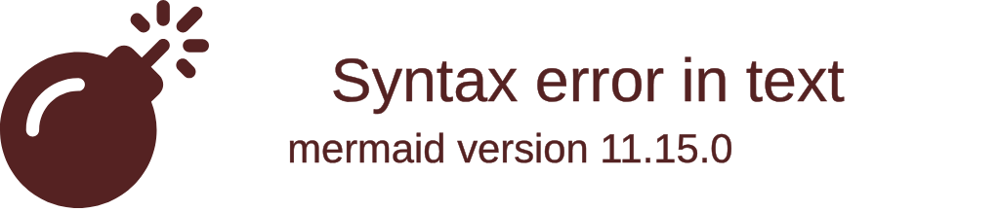

---  
title: Mdx Test - Feat. mermaid  
created: 2025-02-24  
updated: 2025-02-25  
tags: [ 'astro', 'mdx', 'shiki', 'expressive-code', 'mermaid', 'katex' ]  
category: Web  
thumbnail: /files/blog/web/common/assets/mdx-test-thumb.webp  
---  
import ImageLoader from '@/components/Blog/ImageLoader.astro';  
import VideoLoader from '@/components/Blog/VideoLoader.astro';  
import TableOfContents from '@/components/Blog/TableOfContents.astro';  
  
  
import Mermaid from '@/components/Blog/Mermaid.astro';  
  
  
## 시작으로  
Astro에서 제공해주고 있는 Shiki를 통해 코드들이 이쁘게 잘 나오는지 테스트합니다.  
  
expression code를 적용한 경우 .mdx에서는 마크다운과는 달리 mermaid가 제대로 적용되지 않았습니다.  
모종의 이유로 mermaid가 적용되기 이전에 expression code가 codeblock을 변형하기 때문으로 추측되는데,  
아래 블로그에서 제시하는 방법을 참고하여 해당 코드를 변형, 적용했습니다.  
[Adding Mermaid diagrams to Astro MDX](https://xkonti.tech/blog/astro-mermaid-mdx/)  
  
추가 플러그인은 md와 같이 동일합니다.  
  
- astro-expressive-code  
- expressive-code-color-chips  
- @expressive-code/plugin-collapsible-sections  
- @expressive-code/plugin-line-numbers  
- mermaid  
- rehype-katex  
- remark-math  
  
## Mermaid Test  
Mermaid 부분인데, 해당 부분은 .md와 달리 앞서 설명한 바와 같이 따로 처리가 필요하므로,  
Astro 컴포넌트를 따로 만들어 적용시켜줬습니다.  
### 전처리 컴포넌트  
```astro title="preprocess-mermaid.astro"  
---  
export interface Props {  
  title?: string;  
}  
const { title = '' } = Astro.props;  
---  
<figure class="expandable-diagram">  
  <figcaption>{title}</figcaption>  
  
  <div class="diagram-content">Loading diagram...</div> <!-- Loading 부분, CodeBlock의 Mermaid 코드로 대체됩니다. -->  
  <slot /> <!-- Code Block이 들어가는 부분  -->  
</figure>  
  
<script>  
  import mermaid from 'mermaid';  
  type MermaidTheme = 'default' | 'base' | 'dark' | 'forest' | 'neutral' | 'null' | undefined;  
  
  /**  
   * 아래 코드의 로직은 다음과 같습니다.  
   * expressive code가 적용된 Dom을 보면 복사하기 버튼이 있는데, 복사하기 버튼의 data-code attribute에서 CodeBlock을 모두 확인할 수 있습니다.  
   * 이에 해당 data-code를 추출하여 mermaid init을 하고 기존 expressive code dom을 제거합니다.  
   */  
  function extractMermaidCode() {  
    const mermaidElements = document.querySelectorAll('figure.expandable-diagram');  
  
    mermaidElements.forEach((element) => {  
  
      const copyButton = element.querySelector('.copy button');  
  
      if (copyButton == null) return;  
      let code = copyButton.getAttribute('data-code') ?? '';  
  
      code = code.replace(/\u007F/g, '\n');  
  
      // pre dom 생성 후 내부에 copy btn에 있는 code 삽입  
      const preElement = document.createElement('pre');  
      preElement.className = 'language-mermaid';  
      preElement.innerHTML = code;  
      if (preElement.getAttribute('data-original-code') == null) {  
        preElement.setAttribute('data-original-code', code);  
      }  
  
      // loading 부분을 pre code로 대체  
      const diagramContainer = element.querySelector('.diagram-content');  
      if (diagramContainer?.firstChild) {  
        diagramContainer.replaceChild(preElement, diagramContainer.firstChild);  
      }  
  
      // 기존 expressive code 제거  
      const expressiveCode = element.querySelector('.expressive-code');  
      if (expressiveCode) {  
        element.removeChild(expressiveCode);  
      }  
    });  
  }  
  
  async function themeSetHandler() {  
    const theme: MermaidTheme = localStorage.getItem('theme') === 'dark' ? 'dark' : 'default';  
    mermaid.initialize({startOnLoad: false, theme});  
  
    // 앞서 전처리한 pre dom을 통하여 mermaid 실행  
    await mermaid.run({  
      querySelector: '.language-mermaid',  
    });  
  }  
  
  function mermaidInit() {  
    document.body.removeEventListener('theme-set', themeSetHandler)  
    document.body.addEventListener('theme-set', themeSetHandler)  
  
    extractMermaidCode();  
    themeSetHandler()  
  }  
  
  document.addEventListener('astro:after-swap', mermaidInit);  
  document.addEventListener('astro:page-load', mermaidInit);  
</script>  
  
```  
### mdx에서의 전처리 컴포넌트 사용 예  
```txt title="astro mdx mermaid"  
import Mermaid from '@/components/Blog/Mermaid.astro';  
  
<Mermaid>  

  
### expressive code가 적용된 mdx에서의 mermaid 출력.  
<Mermaid>  
  ```mermaid  
  pie title NETFLIX  
  "Time spent looking for movie" : 90  
  "Time spent watching it" : 10  
  ```  
</Mermaid>  
  
<Mermaid>  
  ```mermaid  
  sequenceDiagram  
  Alice ->> Bob: Hello Bob, how are you?  
  Bob-->>John: How about you John?  
  Bob--x Alice: I am good thanks!  
  Bob-x John: I am good thanks!  
  Note right of John: Bob thinks a long<br/>long time, so long<br/>that the text does<br/>not fit on a row.  
  
  Bob-->Alice: Checking with John...  
  Alice->John: Yes... John, how are you?  
  
  ```  
</Mermaid>  
  
<Mermaid>  
  ```mermaid  
  gitGraph:  
  commit "Ashish"  
  branch newbranch  
  checkout newbranch  
  commit id:"1111"  
  commit tag:"test"  
  checkout main  
  commit type: HIGHLIGHT  
  commit  
  merge newbranch  
  commit  
  branch b2  
  commit  
  ```  
</Mermaid>  
  
  
## Each Language / Code Test  
```plain title="example.txt"  
Lorem Ipsum is simply dummy text of the printing and typesetting industry. Lorem Ipsum has been the industry's standard dummy text ever since the 1500s, when an unknown printer took a galley of type and scrambled it to make a type specimen book.  
```  
  
```rust title="example.rs"  
#[derive(Debug)]  
pub enum State {  
    Start,  
    Transient,  
    Closed,  
}  
  
impl From<&'a str> for State {  
    fn from(s: &'a str) -> Self {  
        match s {  
            "start" => State::Start,  
            "closed" => State::Closed,  
            _ => unreachable!(),  
        }  
    }  
}  
```  
  
```json title="example.json"  
[  
  {  
    "title": "apples",  
    "count": [12000, 20000],  
    "description": { "text": "...", "sensitive": false }  
  },  
  {  
    "title": "oranges",  
    "count": [17500, null],  
    "description": { "text": "...", "sensitive": false }  
  }  
]  
```  
  
```python title="example.py"  
@requires_authorization  
def somefunc(param1='', param2=0):  
    r'''A docstring'''  
    if param1 > param2: # interesting  
        print 'Gre\'ater'  
    return (param2 - param1 + 1 + 0b10l) or None  
  
class SomeClass:  
    pass  
  
>>> message = '''interpreter  
... prompt'''  
```  
  
```html title="example.html"  
<!DOCTYPE html>  
<title>Title</title>  
  
<style>  
  body {  
    width: 500px;  
  }  
</style>  
  
<script type="application/javascript">  
  function $init() {  
    return true;  
  }  
</script>  
  
<body>  
  <p checked class="title" id="title">Title</p>  
  <!-- here goes the rest of the page -->  
</body>  
```  
  
```javascript title="example.js"  
function $initHighlight(block, cls) {  
  try {  
    if (cls.search(/\bno\-highlight\b/) != -1)  
      return process(block, true, 0x0F) +  
             ` class="${cls}"`;  
  } catch (e) {  
    /* handle exception */  
  }  
  for (var i = 0 / 2; i < classes.length; i++) {  
    if (checkCondition(classes[i]) === undefined)  
      console.log('undefined');  
  }  
  
  return (  
    <div>  
      <web-component>{block}</web-component>  
    </div>  
  )  
}  
  
export $initHighlight;  
```  
  
```ts title="example.ts"  
import fs from "fs";  
import yaml from "js-yaml";  
  
import {SITE} from "./config";  
  
const language = SITE.language.toLowerCase();  
  
const languages = ["en", "ja", "zh-cn", "zh-tw"];  
  
let i18n: Record<string, any> = {};  
  
if (languages.includes(language)) {  
  i18n = yaml.load(  
    fs.readFileSync(`src/languages/${language}.yml`, "utf8")  
  ) as Record<string, any>;  
} else {  
  i18n = yaml.load(fs.readFileSync(`src/languages/en.yml`, "utf8")) as Record<  
    string,  
    any  
  >;  
}  
  
export const __ = (key: string): string => {  
  const keys = key.split(".");  
  let result = i18n;  
  for (let k of keys) {  
    result = result[k];  
  }  
  return result as unknown as string || key;  
};  
  
export const _p = (key: string, params: string | number): string => {  
  const keys = key.split(".");  
  let result = i18n;  
  for (let k of keys) {  
    result = result[k];  
  }  
  if (typeof params === "number" || !isNaN(parseInt(params))) {  
    if (params === 1) {  
      return result?.one?.replace("%d", params) || key;  
    } else {  
      return result?.other?.replace("%d", params) || key;  
    }  
  } else {  
    return result?.replace("%s", params) || key;  
  }  
};  
```  
  
```cpp title="example.cpp"  
#include <iostream>  
  
int main(int argc, char *argv[]) {  
  
  /* An annoying "Hello World" example */  
  for (auto i = 0; i < 0xFFFF; i++)  
    cout << "Hello, World!" << endl;  
  
  char c = '\n';  
  unordered_map <string, vector<string> > m;  
  m["key"] = "\\\\"; // this is an error  
  
  return -2e3 + 12l;  
}  
```  
  
```sql title="example.sql"  
CREATE TABLE "topic" (  
    "id" serial NOT NULL PRIMARY KEY,  
    "forum_id" integer NOT NULL,  
    "subject" varchar(255) NOT NULL  
);  
ALTER TABLE "topic"  
ADD CONSTRAINT forum_id FOREIGN KEY ("forum_id")  
REFERENCES "forum" ("id");  
  
-- Initials  
insert into "topic" ("forum_id", "subject")  
values (2, 'D''artagnian');  
```  
  
```java title="example.java"  
/**  
 * @author John Smith <john.smith@example.com>  
*/  
package l2f.gameserver.model;  
  
public abstract class L2Char extends L2Object {  
  public static final Short ERROR = 0x0001;  
  
  public void moveTo(int x, int y, int z) {  
    _ai = null;  
    log("Should not be called");  
    if (1 > 5) { // wtf!?  
      return;  
    }  
  }  
}  
```  
  
```swift title="example.swift"  
import Foundation  
  
@objc class Person: Entity {  
  var name: String!  
  var age:  Int!  
  
  init(name: String, age: Int) {  
    /* /* ... */ */  
  }  
  
  // Return a descriptive string for this person  
  func description(offset: Int = 0) -> String {  
    return "\(name) is \(age + offset) years old"  
  }  
}  
```  
  
```css title="example.css"  
@font-face {  
  font-family: Chunkfive;  
  src: url("Chunkfive.otf");  
}  
  
body,  
.usertext {  
  color: #f0f0f0;  
  background: #600;  
  font-family: Chunkfive, sans;  
}  
  
@import url(print.css);  
@media print {  
  a[href^="http"]::after {  
    content: attr(href);  
  }  
}  
```  
  
```ruby title="example.rb"  
# The Greeter class  
class Greeter  
  def initialize(name)  
    @name = name.capitalize  
  end  
  
  def salute  
    puts "Hello #{@name}!"  
  end  
end  
  
g = Greeter.new("world")  
g.salute  
```  
  
```go title="example.go"  
package main  
  
import "fmt"  
  
func main() {  
    ch := make(chan float64)  
    ch <- 1.0e10    // magic number  
    x, ok := <- ch  
    defer fmt.Println(`exitting now\`)  
    go println(len("hello world!"))  
    return  
}  
```  
  
```bash title="example.sh"  
#!/bin/bash  
  
###### CONFIG  
ACCEPTED_HOSTS="/root/.hag_accepted.conf"  
BE_VERBOSE=false  
  
if [ "$UID" -ne 0 ]  
then  
  echo "Superuser rights required"  
  exit 2  
fi  
  
genApacheConf(){  
  echo -e "# Host ${HOME_DIR}$1/$2 :"  
}  
```  
  
```ini title="example.ini"  
; boilerplate  
[package]  
name = "some_name"  
authors = ["Author"]  
description = "This is \  
a description"  
  
[[lib]]  
name = ${NAME}  
default = True  
auto = no  
counter = 1_000  
```  
  
### Katex Test  
  
$f(n) = \Theta(g(n)) \land g(n) = \Theta(h(n)) \rightarrow f(n) = \Theta(h(n))$  
  
$$  
f^{(i)}(n) =  
\begin{cases}  
n \qquad & i = 1 \\  
f(f^{(i-1)}(n)) \qquad & i>1  
\end{cases}  
$$  
  
$$  
A = \begin{bmatrix}  
A_{11} & A_{12} \\  
A_{21} & A_{22}  
\end{bmatrix}  
,  
B = \begin{bmatrix}  
B_{11} & B_{12} \\  
B_{21} & B_{22}  
\end{bmatrix}  
,  
C = \begin{bmatrix}  
C_{11} & C_{12} \\  
C_{21} & C_{22}  
\end{bmatrix}  
$$  
  
  
  
  